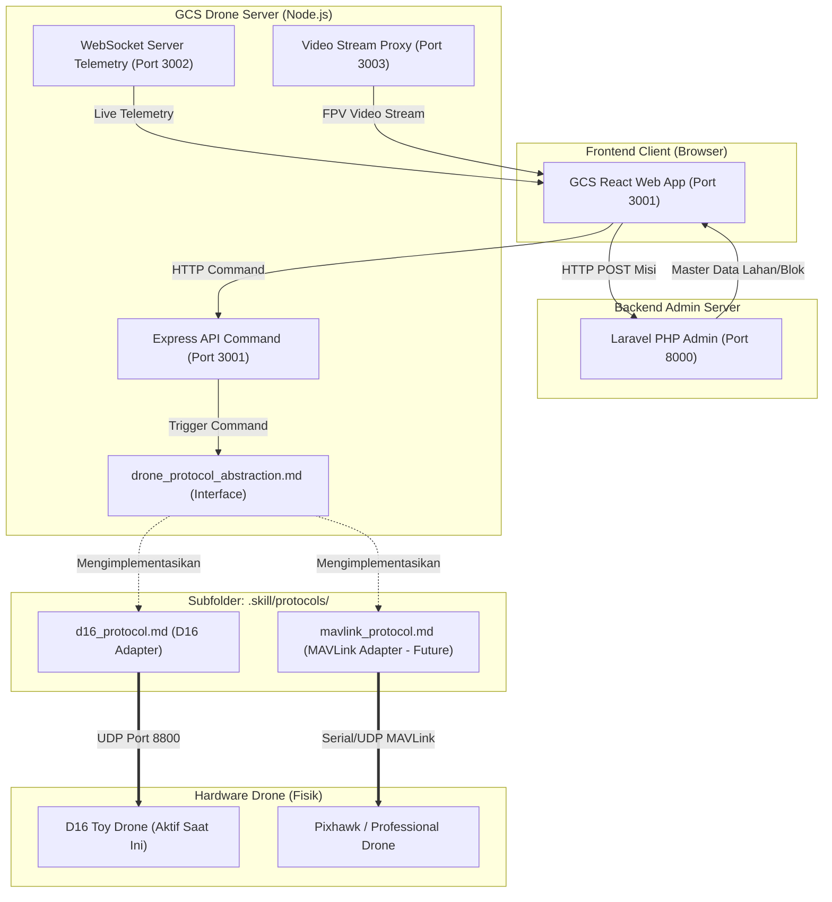

# Sawit GCS - Agent Skill Library

Selamat datang di Agent Skill Library untuk proyek Sawit Ground Control Station (GCS). Proyek ini merupakan sistem kendali hibrida berbasis web untuk mengoperasikan drone pemantau tingkat kematangan buah kelapa sawit di area perkebunan secara otonom. Arsitektur komunikasi drone pada sistem ini dirancang bersifat *pluggable* (dapat diganti) untuk mengantisipasi migrasi perangkat keras drone maupun protokol kontrol di masa depan tanpa merusak logika misi utama pada web GCS.

---

## 1. Panduan Membaca Skill (Peta Berkas)

Tabel berikut menunjukkan kapan dan mengapa Agen AI harus membaca setiap berkas skill:

| Berkas Skill | Kondisi Pemicu (Trigger Condition) | Deskripsi Fungsional |
| :--- | :--- | :--- |
| [README.md](file:///c:/Users/user/Nata/Project/Sawit-Website/monitoring-sawit-web-main/monitoring-sawit-web-main/.skill/README.md) | Setiap kali agen masuk ke proyek | Halaman gerbang masuk utama dan peta navigasi agen. |
| [project_architecture.md](file:///c:/Users/user/Nata/Project/Sawit-Website/monitoring-sawit-web-main/monitoring-sawit-web-main/.skill/project_architecture.md) | Saat menganalisis struktur server, konfigurasi port, atau aliran data | Menjelaskan hubungan Laravel, React, dan Node.js serta alur telemetri/video. |
| [drone_protocol_abstraction.md](file:///c:/Users/user/Nata/Project/Sawit-Website/monitoring-sawit-web-main/monitoring-sawit-web-main/.skill/drone_protocol_abstraction.md) | **SEBELUM** memodifikasi kode kontrol drone ATAU saat menambahkan drone/protokol baru | Mendefinisikan kontrak/interface abstrak yang menjembatani server dengan drone fisik. |
| [pdf_agent.md](file:///c:/Users/user/Nata/Project/Sawit-Website/monitoring-sawit-web-main/monitoring-sawit-web-main/.skill/pdf_agent.md) | Saat diminta meninjau atau menganalisis PDF spesifikasi hardware baru | Panduan mengekstrak dan menilai kelayakan hardware drone (GPS, RTK, LiDAR, Kamera) terhadap misi. |
| [protocols/d16_protocol.md](file:///c:/Users/user/Nata/Project/Sawit-Website/monitoring-sawit-web-main/monitoring-sawit-web-main/.skill/protocols/d16_protocol.md) | Saat men-debug atau memodifikasi fungsionalitas drone D16 | Panduan implementasi detail protokol D16 yang saat ini sedang aktif digunakan. |

> [!IMPORTANT]
> **Jika drone/protokol baru akan ditambahkan**: Anda WAJIB membaca [drone_protocol_abstraction.md](file:///c:/Users/user/Nata/Project/Sawit-Website/monitoring-sawit-web-main/monitoring-sawit-web-main/.skill/drone_protocol_abstraction.md) terlebih dahulu sebelum membuat berkas protokol baru di folder [protocols/](file:///c:/Users/user/Nata/Project/Sawit-Website/monitoring-sawit-web-main/monitoring-sawit-web-main/.skill/protocols/).

---

## 2. Diagram Hubungan Layer Sistem

Berikut adalah hubungan antara komponen web, server proxy, lapisan abstraksi protokol, dan perangkat keras drone fisik:

---

## 3. Status Protokol Aktif

* **Protokol Aktif Saat Ini**: **D16 (Toy Drone)**
* **Spesifikasi Teknis**: [d16_protocol.md](file:///c:/Users/user/Nata/Project/Sawit-Website/monitoring-sawit-web-main/monitoring-sawit-web-main/.skill/protocols/d16_protocol.md)
* **Status Misi**: Terhubung melalui jaringan WiFi D16 dengan simulasi auto-binding.
