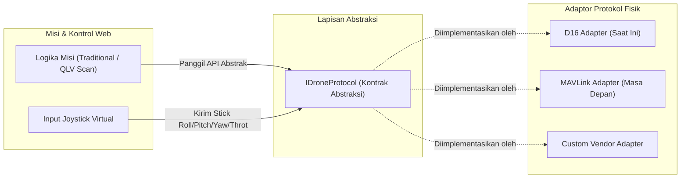

# Abstraksi Protokol Drone (IDroneProtocol Contract)

Berkas ini mendefinisikan lapisan kontrak (*interface*) abstrak komunikasi antara sistem GCS dan drone fisik. Tujuannya adalah mengisolasi logika navigasi misi (seperti *Traditional Scan* dan *QLV Scan*) agar tidak bergantung pada jenis drone, vendor, atau protokol biner tertentu (seperti D16 atau MAVLink).

---

## 1. Hubungan Layer Abstraksi Protokol

Diagram berikut menunjukkan bagaimana logika misi dan panel kontrol web terisolasi dari protokol fisik melalui interface perantara:

---

## 2. Tabel Kontrak Kontrol Abstrak (IDroneProtocol)

Setiap implementasi protokol baru wajib memenuhi kontrak fungsional berikut:

| Kontrak Fungsi | Deskripsi Fungsional | Contoh Implementasi D16 (Aktif) | Ekspektasi Protokol Baru (MAVLink) |
| :--- | :--- | :--- | :--- |
| **Connect / Handshake** | Membangun jembatan komunikasi awal dengan drone fisik. | Mengirim `INIT_PACKET` `[0xef, 0x00, 0x04, 0x00]` secara berkala. | Melakukan jabat tangan (*handshake*) serial atau membaca detak jantung (`HEARTBEAT`) MAVLink. |
| **Arm / Disarm** | Membuka kunci motor (*arming*) agar baling-baling berputar rendah, atau menguncinya kembali. | Melakukan *throttle sweep* (UP->DOWN) disusul pengiriman flag byte `0x40`. | Mengirim pesan MAVLink `COMMAND_LONG` dengan parameter `MAV_CMD_COMPONENT_ARM_DISARM`. |
| **Attitude & Throttle Control** | Mengatur sudut kemiringan (*roll, pitch, yaw*) dan gaya angkat (*throttle*) secara real-time. | Mengirim paket 88-byte dengan offset byte `20` s.d `23` bernilai `0 - 255`. | Mengirim pesan `SET_POSITION_TARGET_LOCAL_NED` atau memanipulasi channel RC overriding. |
| **Telemetry Parser** | Membaca data status kembali (*return telemetry*) dari sensor drone ke GCS. | *Tidak ada* (D16 disimulasikan secara tiruan di backend Node.js). | Membaca pesan MAVLink `GLOBAL_POSITION_INT` (GPS) dan `SYS_STATUS` (Baterai). |
| **Camera Trigger (Single/Dual)**| Menginstruksikan modul kamera onboard drone untuk menangkap gambar. | *Tidak ada* (D16 hanya melayani kamera FPV kontinu lewat proxy). | Mengirim sinyal GPIO melalui MAVLink `MAV_CMD_DO_DIGICAM_CONTROL` atau API SDK Jetson Nano. |
| **Failsafe & Error Handling** | Prosedur penyelamatan jika terjadi putusnya sinyal kontrol (*loss of link*). | *Tidak ada* (Jika sinyal putus, drone D16 akan terbang tak tentu arah). | Mengaktifkan mode otomatis RTL (*Return To Launch*) atau Auto-Land di Pixhawk. |

> 🔄 Akan berubah jika drone/protokol berganti.

---

## 3. Panduan Onboarding Protokol Baru

Ketika diminta untuk "menambahkan dukungan untuk drone atau protokol baru X", ikuti langkah terstruktur berikut:

1. **Pembuatan Dokumen Spesifikasi**:
   Buat file baru di subfolder `.skill/protocols/<nama_protokol>_protocol.md` menggunakan struktur yang sama seperti [d16_protocol.md](file:///c:/Users/user/Nata/Project/Sawit-Website/monitoring-sawit-web-main/monitoring-sawit-web-main/.skill/protocols/d16_protocol.md).
2. **Pemetaan Kontrak**:
   Isi tabel pemetaan antara Kontrak Abstrak (Tabel Seksi 2) dengan kode/fungsi biner protokol baru yang Anda tambahkan.
3. **Isolasi Logika Misi**:
   Pastikan Anda tidak mengubah atau menghapus kode logika level misi (seperti rute penerbangan *Dead-Reckoning* di controller Laravel atau frontend React). Modifikasi hanya diperbolehkan pada layer *adapter* Node.js.
4. **Pembaruan Konfigurasi & README**:
   * Ubah status "Protokol Aktif" pada [README.md](file:///c:/Users/user/Nata/Project/Sawit-Website/monitoring-sawit-web-main/monitoring-sawit-web-main/.skill/README.md) untuk menunjuk ke protokol baru.
   * Tandai dokumen protokol lama sebagai `protocol_status: archived` pada metadata header file. **Jangan hapus berkas protokol lama** untuk keperluan riwayat dan pemulihan (*rollback*).

---

## 4. Titik Sentuh Kode Aktual (Code Touchpoints)

Berikut adalah berkas-berkas dalam repositori yang saat ini langsung mengeksekusi logika kontrol drone fisik dan harus diubah menjadi sistem adaptor saat migrasi:

* **[drone-server/index.js](file:///c:/Users/user/Nata/Project/Sawit-Website/monitoring-sawit-web-main/monitoring-sawit-web-main/drone-server/index.js)**:
  * *Status Saat Ini*: Kode memuat perakitan byte D16 biner secara langsung di dalam fungsi `buildPacket()`, `sendPacket()`, dan `runBindSequence()`.
  * *Tindakan Migrasi*: Logika perakitan paket D16 ini harus dipecah ke berkas adaptor terpisah (misal `D16Adapter.js`), dan `index.js` hanya memanggil antarmuka seragam.
* **[drone-server/tests/test-movement.js](file:///c:/Users/user/Nata/Project/Sawit-Website/monitoring-sawit-web-main/monitoring-sawit-web-main/drone-server/tests/test-movement.js)**:
  * *Status Saat Ini*: Menguji langsung fungsionalitas paket biner dan status IMU dari kontroler lama.
  * *Tindakan Migrasi*: Harus disesuaikan untuk menguji fungsi adaptor baru.

> ⚠️ TODO: Verifikasi letak berkas adapter baru setelah rancangan refaktor adaptor disetujui.

---

## 5. Pelajaran dari D16 → MAVLink

Berikut adalah asumsi desain saat ini yang terlalu terikat pada keterbatasan hardware D16 dan harus dihindari di masa depan:

* **Asumsi Rentang Nilai Kontrol (0 - 255)**:
  * D16 menggunakan rentang byte `0 - 255` dengan nilai tengah `128`. Protokol seperti MAVLink atau RC PWM umumnya menggunakan rentang standar mikrodetik `1000 - 2000` dengan nilai tengah `1500`. Lapisan kontrol web harus menangani konversi unit ini secara dinamis di server Node.js.
* **Simulasi Umpan Balik (Mock Telemetry)**:
  * Saat ini, frontend menampilkan telemetri palsu yang dihitung di memori berdasarkan perintah yang dikirim. Di MAVLink, semua parameter telemetri wajib diambil dari pembacaan sensor fisik asli drone demi keselamatan terbang.
* **Watchdog Berbasis Jeda Waktu (Timeout)**:
  * D16 membutuhkan trigger heartbeat asinkron yang ketat agar video streaming tidak berhenti. Pada Pixhawk, video dan telemetri dipisah jalurnya secara fisik (Video via kamera IP RTSP, Telemetri via modul Radio telemetry 915MHz), sehingga logika pemeliharaan koneksi (*keep-alive link*) harus dikonfigurasi secara mandiri.
