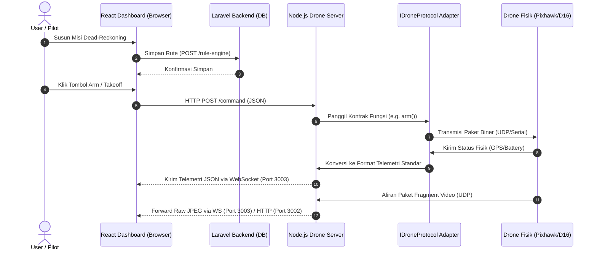

# Arsitektur Proyek & Aliran Data Sistem GCS

Dokumen ini menjelaskan arsitektur perangkat lunak modular pada sistem Sawit Ground Control Station (GCS). Arsitektur ini dirancang agar protokol drone fisik bertindak sebagai modul adaptor (*pluggable*) yang terisolasi dari antarmuka pengguna (UI) dan logika database.

---

## 1. Diagram Aliran Data Sistem

Berikut adalah alur kendali instruksi dari pengguna hingga ke drone fisik, serta jalur balik telemetri dan video FPV:



---

## 2. Pemetaan Port Sistem

Setiap subsistem berkomunikasi menggunakan port jaringan berikut. Agen wajib memverifikasi fungsionalitas port ini saat melakukan pengujian:

| Port | Protokol | Komponen Asal | Komponen Tujuan | Deskripsi Fungsional | File Konfigurasi Terkait |
| :--- | :--- | :--- | :--- | :--- | :--- |
| **8000** | HTTP | Web Browser | Laravel Backend | Menyajikan data master, autentikasi, dan menyimpan rute terbang ke database. | [app/Http/Controllers/DeadReckoningController.php](file:///c:/Users/user/Nata/Project/Sawit-Website/monitoring-sawit-web-main/monitoring-sawit-web-main/app/Http/Controllers/DeadReckoningController.php) |
| **3001** | HTTP | React GCS | Node.js Server | Menerima instruksi kontrol instan (Takeoff, Land, Joystick) dan eksekusi rute misi. | [drone-server/index.js](file:///c:/Users/user/Nata/Project/Sawit-Website/monitoring-sawit-web-main/monitoring-sawit-web-main/drone-server/index.js) |
| **3002** | HTTP (MJPEG) | React GCS | Node.js Server | Mengalirkan video FPV dalam bentuk aliran multipart JPEG. | [drone-server/index.js](file:///c:/Users/user/Nata/Project/Sawit-Website/monitoring-sawit-web-main/monitoring-sawit-web-main/drone-server/index.js) |
| **3003** | WebSocket | React GCS | Node.js Server | Mengirimkan telemetri real-time dan aliran data biner gambar JPEG secara cepat. | [drone-server/index.js](file:///c:/Users/user/Nata/Project/Sawit-Website/monitoring-sawit-web-main/monitoring-sawit-web-main/drone-server/index.js) |
| **8800** | UDP | Node.js Server | Drone Fisik | Mengirimkan paket biner kontrol kemudi langsung ke modul WiFi drone. | [drone-server/index.js](file:///c:/Users/user/Nata/Project/Sawit-Website/monitoring-sawit-web-main/monitoring-sawit-web-main/drone-server/index.js) |

> 🔄 Akan berubah jika drone/protokol berganti (terutama Port 8800 UDP yang dapat beralih ke Serial Baudrate atau TCP Port).

---

## 3. Protokol Aliran Telemetri & Video

### A. Alur Telemetri Real-Time (Node.js $\rightarrow$ React)
* **Frekuensi Pembaruan**: Minimal **10 Hz** (setiap 100ms) untuk menjamin pergerakan indikator HUD cockpit yang halus.
* **Payload JSON Standar**: Agar frontend React tidak perlu dimodifikasi saat drone berganti, Node.js server wajib menerjemahkan telemetri mentah menjadi format JSON standar berikut sebelum dikirim via WebSocket:
  ```json
  {
    "roll": 128,
    "pitch": 128,
    "yaw": 128,
    "throttle": 128,
    "battery_pct": 85,
    "altitude_m": 2.4,
    "gps_lat": -2.34567,
    "gps_lng": 102.34567,
    "is_armed": true
  }
  ```

### B. Alur Video Streaming
* **Codec**: Motion JPEG (MJPEG) untuk kemudahan decoding tanpa beban CPU berat pada companion computer. 
* **Frame Rate**: Ditargetkan pada kisaran **15 - 25 FPS** dengan resolusi bawaan `640x360` piksel.
* **Buffering Strategy**: Node.js bertindak sebagai *zero-buffer proxy*. Setiap kali potongan paket fragment JPEG diterima dari drone, Node.js langsung menyatukannya dan memancarkannya ke semua klien WebSocket aktif tanpa menunda di antrean memori.

---

## 4. Catatan Migrasi Protokol/Drone

Detail mengenai bagaimana cara mengintegrasikan protokol baru atau mengganti drone fisik tanpa merusak arsitektur data GCS ini didokumentasikan secara lengkap pada berkas abstraksi utama:
* **Lihat**: [drone_protocol_abstraction.md](file:///c:/Users/user/Nata/Project/Sawit-Website/monitoring-sawit-web-main/monitoring-sawit-web-main/.skill/drone_protocol_abstraction.md)
* *Peringatan*: Hindari menduplikasi logika parser byte drone di luar modul adapter khusus agar kode program tetap bersih dan modular.
