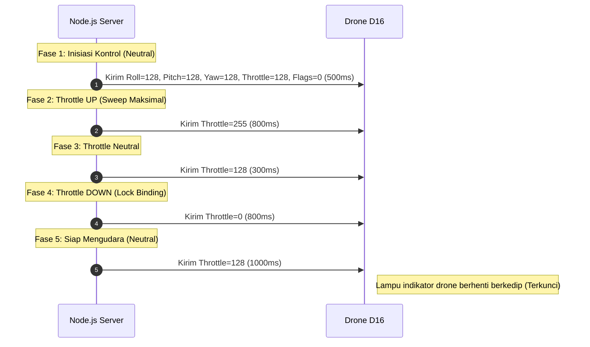

# Protokol Kontrol Drone D16 (Active Protocol Specification)

> 📌 **Status**: Protokol **AKTIF** saat ini. Mengimplementasikan kontrak di [drone_protocol_abstraction.md](file:///c:/Users/user/Nata/Project/Sawit-Website/monitoring-sawit-web-main/monitoring-sawit-web-main/.skill/drone_protocol_abstraction.md). Jika drone berganti di kemudian hari, berkas spesifikasi ini akan diarsipkan (dipindahkan statusnya menjadi *archived*), bukan dihapus.

Berkas ini memuat rincian paket biner, handshake binding, dan bendera perintah (*command flags*) untuk drone mainan D16 yang saat ini digunakan sebagai platform pengujian.

---

## 1. Struktur Byte Paket Kontrol D16 (88 Byte)

Komunikasi kontrol dilakukan dengan mengirimkan paket UDP 88-byte kontinu ke IP `192.168.169.1` Port `8800`. Berikut susunan offset biner dari fungsi `buildPacket()`:

| Offset (byte) | Panjang (byte) | Field | Tipe Data | Range Nilai | Keterangan / Fungsi |
| :--- | :--- | :--- | :--- | :--- | :--- |
| **0** | 1 | Magic Header 1 | UInt8 | `0xef` | Penanda awal paket kontrol. |
| **1** | 1 | Magic Header 2 | UInt8 | `0x02` | Sub-header tipe kontrol. |
| **2** | 1 | Magic Header 3 | UInt8 | `0x58` | Ukuran paket (desimal 88). |
| **3** | 1 | Magic Header 4 | UInt8 | `0x00` | Suffix header ukuran paket. |
| **4 - 7** | 4 | Magic Sub-headers | UInt8[4] | `0x02,0x02,0x00,0x01` | Nilai statis penyelarasan transceiver. |
| **12 - 15** | 4 | Sequence Counter | UInt32LE | `0 s.d 4294967295` | Angka urutan paket yang terus bertambah. |
| **16 - 19** | 4 | Transmit Config | UInt8[4] | `0x14,0x00,0x66,0x14` | Konfigurasi transmisi radio statis. |
| **20** | 1 | Roll | UInt8 | `0 s.d 255` | Kendali kemiringan kiri-kanan (Tengah/Netral = `128`). |
| **21** | 1 | Pitch | UInt8 | `0 s.d 255` | Kendali maju-mundur (Tengah/Netral = `128`). |
| **22** | 1 | Throttle | UInt8 | `0 s.d 255` | Kendali ketinggian naik-turun (Tengah/Netral = `128`). |
| **23** | 1 | Yaw | UInt8 | `0 s.d 255` | Kendali rotasi hadap kiri-kanan (Tengah/Netral = `128`). |
| **24** | 1 | Command Flags | UInt8 | *Lihat Seksi 4* | Bit bendera pemicu perintah lepas landas/mendarat/ARM. |
| **25** | 1 | Headless Mode | UInt8 | `0x00` (Off) / `0x02` (On) | Mode orientasi hadap drone kustom. |
| **36** | 1 | Checksum XOR | UInt8 | `0 s.d 255` | XOR byte `20` ^ `21` ^ `22` ^ `23` ^ `24` ^ `25`. |
| **37** | 1 | Static Suffix | UInt8 | `0x99` | Penutup payload kontrol utama. |
| **82 - 85** | 4 | Tail Magic | UInt8[4] | `0x32,0x4b,0x14,0x2d` | Byte penutup paket (ekor transmisi). |

> 🔄 Akan berubah jika drone/protokol berganti.

---

## 2. Pemetaan Kontrak Abstrak ke Protokol D16

| Kontrak Fungsi (Abstrak) | Implementasi Command D16 (Konkret) |
| :--- | :--- |
| **Connect / Handshake** | Mengirim berkala paket `INIT_PACKET` `[0xef,0x00,0x04,0x00]` ke port `8800`. |
| **Arm / Disarm** | Eksekusi `runBindSequence()`, dilanjutkan mengirim Byte `24` (Flags) bernilai `0x40`. |
| **Attitude & Throttle Control** | Menulis input kemudi `roll`, `pitch`, `throttle`, `yaw` pada offset byte `20 s.d 23`. |
| **Telemetry Parser** | *Tidak didukung oleh hardware D16* (Tidak mengirim data balik ke server). |
| **Camera Trigger** | *Tidak didukung oleh hardware D16* (Kamera bersifat pasif FPV stream). |
| **Failsafe / Emergency** | Mengirim Byte `24` (Flags) bernilai `0x04` (CMD_EMERGENCY) dan menarik `throttle = 0`. |

> 🔄 Akan berubah jika drone/protokol berganti.

---

## 3. Handshake & Auto-Binding Sequence

Drone D16 mewajibkan urutan sweep stik throttle untuk menyelesaikan proses *pairing* sebelum motor dapat di-ARM. Berikut diagram alir urutan binding otomatis (`runBindSequence`):



---

## 4. Tabel Bendera Perintah (Command Flags)

Fungsi pemicu khusus ditransmisikan melalui **Byte Offset 24** (Flags). Setiap flag dikirimkan dalam bentuk denyut (*pulse*) selama kurang lebih **1.5 - 2 detik** sebelum dikembalikan ke nilai `0`:

| Bit / Flag | Nama Flag | Fungsi Kontrol | Nilai Default |
| :--- | :--- | :--- | :--- |
| **`0x01`** | `CMD_TAKEOFF` | Lepas landas otomatis (*auto takeoff*) ke ketinggian ~1.2 meter. | `0x00` |
| **`0x02`** | `CMD_LAND` | Mendarat perlahan (*auto landing*) dan mematikan motor. | `0x00` |
| **`0x04`** | `CMD_EMERGENCY` | Memutus daya motor seketika (*kill switch*). | `0x00` |
| **`0x40`** | `CMD_UNLOCK_MOTOR` | Menyalakan motor (*arming/unlock motor*) setelah proses binding. | `0x00` |
| **`0x80`** | `CMD_CALIBRATE` | Mengalibrasi sensor kemiringan (*gyro calibration*) sebelum lepas landas. | `0x00` |

> 🔄 Akan berubah jika drone/protokol berganti.

---

## 5. Panduan Pengujian Manual

Pengujian validitas kode parser dan format enkapsulasi D16 dapat diverifikasi secara mandiri menggunakan skrip pengujian [tests/test-movement.js](file:///c:/Users/user/Nata/Project/Sawit-Website/monitoring-sawit-web-main/monitoring-sawit-web-main/drone-server/tests/test-movement.js).

### A. Cara Menjalankan Uji Coba
Buka terminal baru di folder server drone, lalu eksekusi perintah:
```powershell
node .\drone-server\tests\test-movement.js
```

### B. Parameter Pengujian Utama
Anda dapat mengubah parameter pengujian di dalam berkas [tests/test-movement.js](file:///c:/Users/user/Nata/Project/Sawit-Website/monitoring-sawit-web-main/monitoring-sawit-web-main/drone-server/tests/test-movement.js) untuk memverifikasi perilaku kontroler:
*   `roll = 0` (ke kiri maksimal) atau `255` (ke kanan maksimal).
*   `flags = 0x01` (Takeoff) untuk memverifikasi kalkulasi checksum XOR dinamis.
*   Simulasi `emergency` untuk memastikan sistem mengunci kemudi dan menolak perintah navigasi berikutnya.

### C. Ekspektasi Output Sukses
Skrip akan mencetak status kelulusan pengujian unit asinkron:
```text
=== D16 Movement Controller Tests ===
Packet Builder:
  ✅ buildPacket returns 88 bytes
  ✅ Default controls are neutral (128)...
  ✅ Checksum byte[36] = XOR of bytes 20-25
...
========================================
Results: 28 passed, 0 failed
🎉 ALL TESTS PASSED
```
Jika ada perubahan bit pada server yang merusak enkapsulasi, sistem pengujian otomatis akan menampilkan kegagalan (`failed > 0`).
